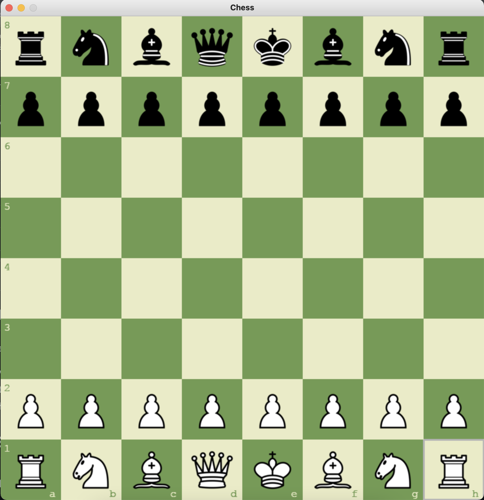
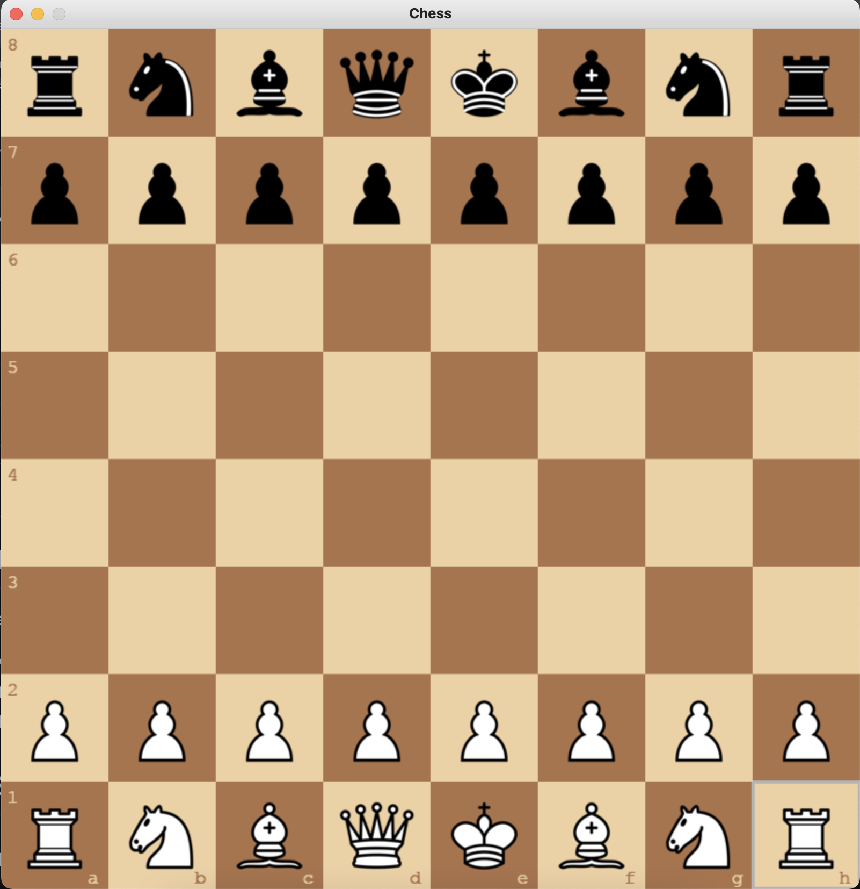
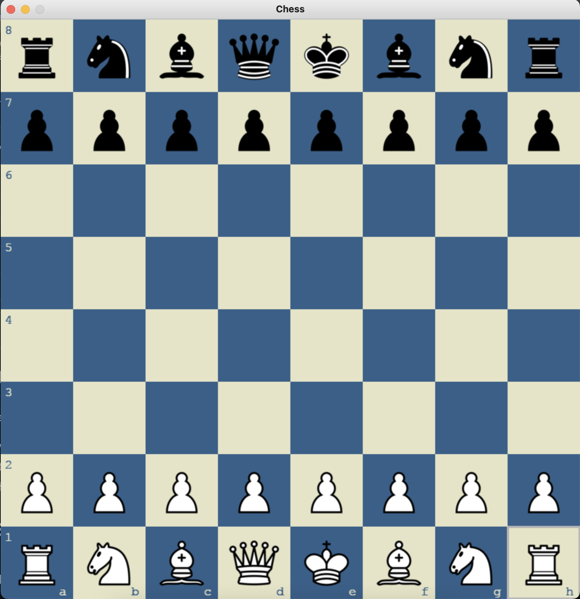
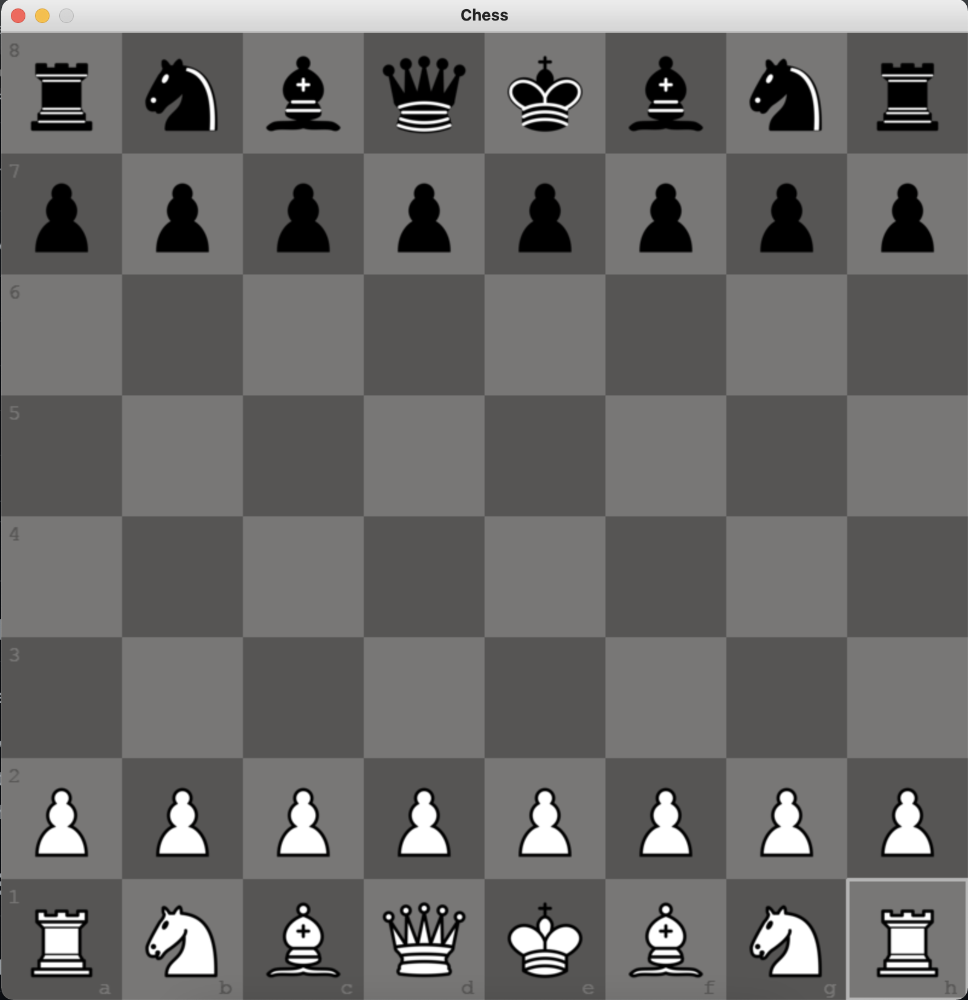
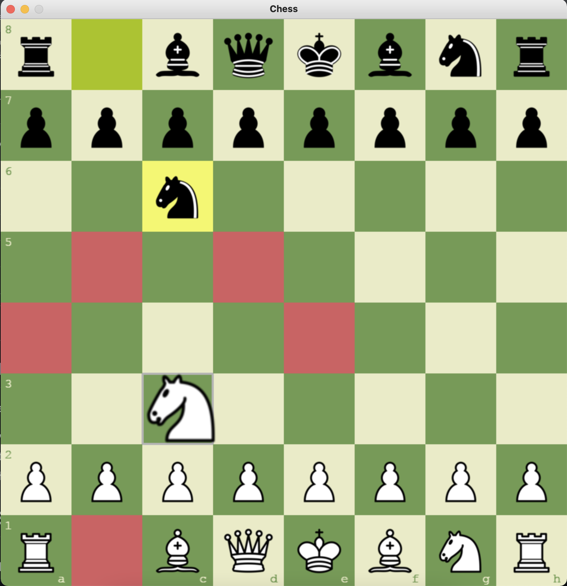
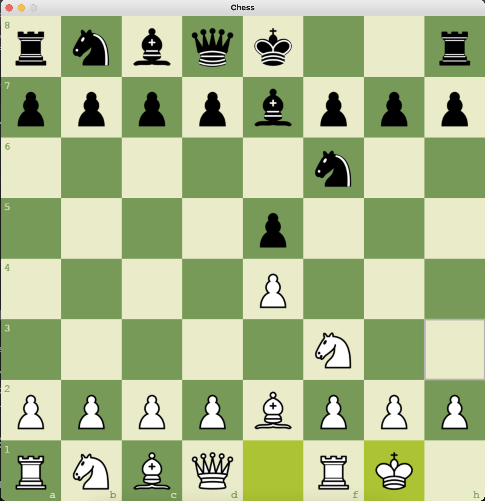

# Game Instructions

* Working on AI gamemode...

- Entry point: main.py
- Press 't' to change theme (green, brown, blue, gray)
- Press 'r' to restart the game

# Game Snapshots

## Snapshot 1 - Start (green)

## Snapshot 2 - Start (brown)

## Snapshot 3 - Start (blue)

## Snapshot 4 - Start (gray)

## Snapshot 5 - Valid Moves

## Snapshot 6 - Castling

